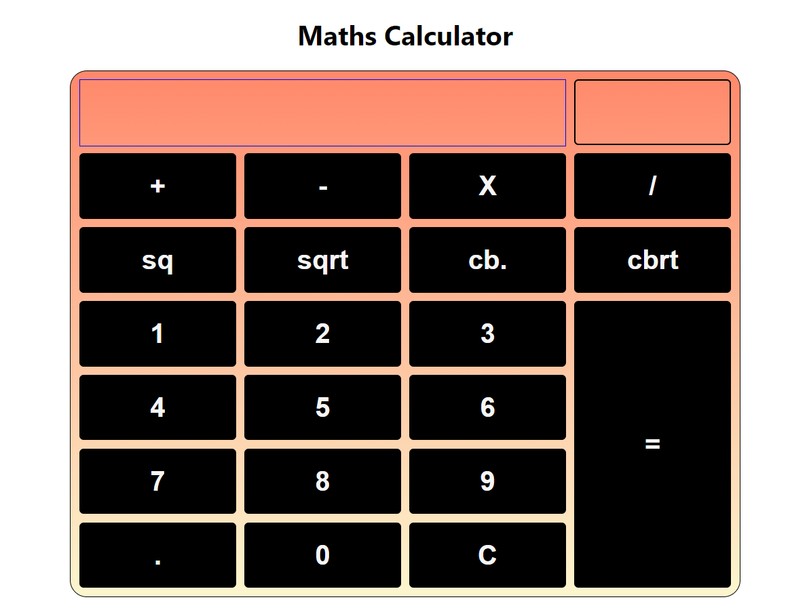

# calculator

### Project Discription
 This project is a calculator web application. In this calculator you can perform all mathematical operation for two number. Also you can perform square, square root, cube and cube root on a number. 

### Made by :- Deepanshu Gulia

### Tech stack :- 
 HTML | CSS | Javascript | Reactjs | vercel

## Image of project

